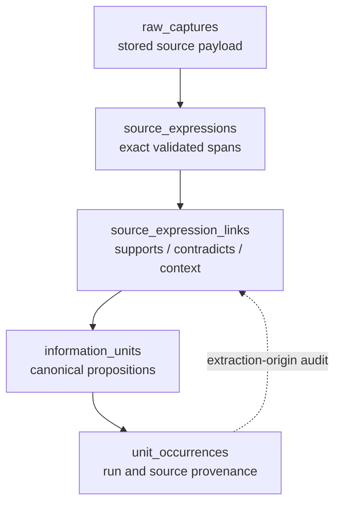
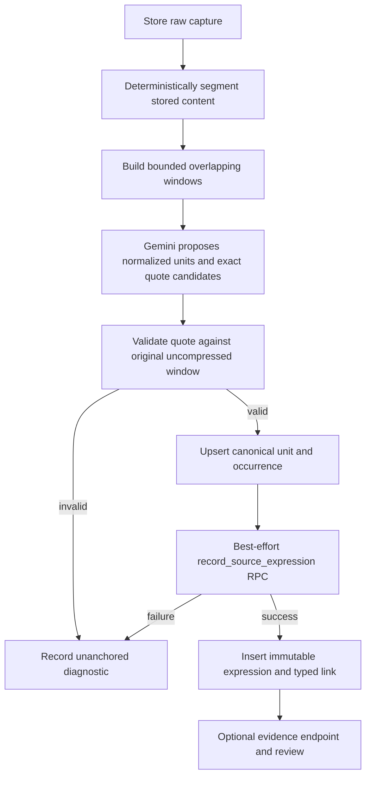

# Scoutpost Source Expressions and Deterministic Unit Provenance PRD

## Summary

Repair canonical-unit deduplication first, then add immutable, exact passages
from `raw_captures` as evidence linked many-to-many to canonical
`information_units`. The rollout preserves every existing unit and search
contract, starts as a non-blocking shadow write, and makes deterministic
evidence available for later review and report guardrails without turning
sentences into canonical units.

## Implementation record

Completed in the `source-expressions` JJ workspace on 2026-07-16. The manual
ingest path is the intentionally limited shadow pilot: it writes only exact
quotes found in a deterministic stored-source window, after canonical upsert,
and treats every evidence error as non-blocking. Expansion to scout callers
remains gated on observed pilot coverage, rejection reasons, latency, and
review utility; no scout caller was expanded by this implementation.

---

## Verdict

The useful NewsAtom idea fits Scoutpost: preserve what the source actually said
separately from the normalized proposition Scoutpost uses for deduplication and
retrieval. It solves a real gap in verification, quotation retrieval,
multilingual source wording, and adversarial review.

The proposal is safe only after the canonical deduplication function is
repaired. The current database path can merge different statements from one
article, and the latest overload of that function also lost the documented
social/non-social semantic boundary. Adding better evidence before repairing
identity would make incorrect merges easier to inspect, not correct.

The target model is:

`information_units.statement` remains the canonical proposition. A source
expression is evidence, not a second fact store and not a sentence atom.

---

## Problem Frame

Scoutpost already separates canonical knowledge from source occurrences:
`information_units` holds a normalized fact and `unit_occurrences` records where
that fact appeared. The missing layer is the exact source wording that supports,
contradicts, or contextualizes the normalized fact.

Today `context_excerpt` cannot serve that role. It is generated by a model,
nullable, stored only on the canonical unit, and retained with a first-nonempty
policy. It has no deterministic locator or hash, so later source occurrences
cannot preserve their own wording and a reviewer cannot prove that the excerpt
exists in the stored capture.

Extraction also operates on a compressed head slice. The shared atomic extractor
defaults to 3,000 characters; callers commonly use 2,200-12,000 characters.
Manual ingest stores at most 100,000 characters and prompts on 12,000 compressed
characters. Civic stores at most 80,000 and prompts on 40,000 compressed
characters. This is useful summarization behavior but is not full-document,
deterministic source preservation.

### Confirmed correctness defects

1. `upsert_canonical_unit` checks normalized URL and whole-document hash before
   `statement_hash`. Two distinct statements from one capture therefore resolve
   to the first canonical unit. This conflicts with the occurrence uniqueness
   indexes, which explicitly include `statement_hash` and therefore expect more
   than one fact per source.
2. Migration `00046_fact_check_columns.sql` added a new function signature
   instead of removing the preceding signature. PostgreSQL therefore retains two
   callable overloads. The newer overload omits `allow_semantic_scout_match`, so
   the production wrapper and an older benchmark can execute different semantic
   boundary behavior.
3. Beat Scout hashes the full scraped markdown but stores only the first 200,000
   characters. For a long capture, `raw_captures.content_sha256` is not the hash
   of `raw_captures.content_md`. It cannot be used as the deterministic evidence
   payload hash.
4. Hybrid keyword search is generated with PostgreSQL's `english` configuration
   even though canonical statements can be emitted in the user's preferred
   language. It indexes one canonical `context_excerpt`, not occurrence-specific
   source wording.

### Current safety baseline

The relevant stack-free Deno suites pass: 53 tests, 0 failures across unit dedup
helpers, atomic extraction date handling, canonical baselines, web
canonicalization, TACO compression, and unit search utilities. The extraction
and dedup modules also pass targeted `deno check`.

Those tests do not execute the SQL matching function. The current dedup test
mocks `.rpc()`, the extraction tests do not test chunk coverage or exact
anchors, and the search tests do not execute PostgreSQL FTS. A local database
integration run was unavailable because the expected Supabase database container
was not running. The existing passing tests are therefore a regression baseline,
not evidence that the confirmed SQL defects are safe.

---

## Goals

- Make every preserved source expression provably identical to a span in the
  stored raw capture.
- Keep canonical facts normalized and deduplicated across sources while
  preserving every occurrence's original language and wording.
- Correct canonical dedup so source identity never substitutes for proposition
  identity.
- Support many-to-many evidence: several passages may support one fact, one
  passage may support several facts, and a passage may contradict or merely
  contextualize a fact.
- Enable deterministic evidence eligibility for findings, adversarial review,
  and future report generation.
- Add granularity without adding a required network service, vector index, or
  synchronous failure to the existing unit ingestion path.
- Preserve current unit, search, MCP, CLI, and frontend response shapes by
  default.

---

## Scope Boundaries

### Included

- Canonical dedup repair and regression characterization.
- One authoritative `upsert_canonical_unit` signature with fact-check fields and
  the social/non-social semantic boundary intact.
- Deterministic source segmentation, exact-passage validation, and versioned
  locators.
- Additive `source_expressions` and `source_expression_links` tables with RLS.
- A service-only recording RPC and a non-blocking manual-ingest pilot.
- An owner-only evidence read endpoint after the shadow-write pilot passes.
- Evidence/review state sufficient for a deterministic downstream eligibility
  check.

### Deferred

- Expression embeddings. Canonical statement embeddings remain the semantic
  search and dedup representation.
- Adding expression text to the default hybrid-search RPC. An opt-in expression
  FTS lane may follow measured retrieval tests.
- Changing canonical FTS from `english` to `simple` or per-language
  configuration. That deserves its own ranking benchmark and migration.
- Long-lived evidence pinning beyond the existing `raw_captures` retention
  policy.
- Team-member evidence reads. Shared projects can expose canonical units today,
  but raw captures remain owner-only.
- Automatic repair of already-collapsed units.

### Explicitly rejected

- One canonical information unit per sentence.
- NewsAtom's subject/predicate/object or knowledge-frame taxonomy as the
  Scoutpost canonical model.
- Model-authored text accepted as source evidence without exact validation.
- A persistent chunk table in the first version.
- Ambiguous backfill from `context_excerpt`.
- A new expression vector index or an evidence join in the default search hot
  path.

---

## Requirements

### Canonical identity and deduplication

- R1. Exact canonical matching MUST require the normalized `statement_hash`.
  `normalized_source_url`, `content_sha256`, and `raw_capture_id` may scope or
  describe an occurrence, but MUST NOT independently select a canonical fact.
- R2. The database MUST expose exactly one callable `upsert_canonical_unit`
  signature. It MUST retain the current fact-check inputs, most-confident-wins
  behavior, advisory lock, occurrence counters, and `allow_semantic_scout_match`
  boundary.
- R3. The repair MUST characterize units with multiple distinct occurrence
  statement hashes, especially within one raw capture. It MUST NOT auto-split
  them because hashes do not recover the lost normalized statements and some
  semantic merges may be legitimate.
- R4. Identical normalized statements from different sources MUST still converge
  on one canonical unit with separate occurrences. Different statements sharing
  a URL or document hash MUST remain distinct unless the semantic rule merges
  them.

### Exact source preservation

- R5. A source expression MUST contain exact text derived by the application or
  database from `raw_captures.content_md`; the model's proposed quote is only a
  locator candidate.
- R6. Every expression MUST carry a versioned, zero-based, half-open UTF-8 byte
  range, one-based display line range, a stored-payload SHA-256, passage
  SHA-256, and passage fingerprint. The validator MUST reject a one-byte
  mismatch, invalid boundary, wrong capture, or ambiguous repeated passage.
- R7. Stored-payload hashing MUST be computed from the UTF-8 encoding of the
  stored `content_md`. It MUST NOT assume the existing `content_sha256` has that
  meaning.
- R8. Original whitespace, punctuation, Unicode, and language MUST be preserved.
  The exact expression MUST NOT be translated or TACO-compressed.
- R9. Segmentation MUST be deterministic and versioned. The same stored payload
  and segmentation version MUST produce identical segment/window identifiers and
  ranges.
- R10. Full-capture coverage MUST be explicit. If a cost or size cap stops
  processing, the occurrence MUST be marked `partial`; the system MUST NOT
  present a head slice as a fully reviewed capture.

### Evidence relationships and review

- R11. Expressions and canonical units MUST be many-to-many through typed links:
  `supports`, `contradicts`, or `context`.
- R12. Extraction-created `supports` links MUST reference the originating
  `unit_occurrence` and MUST match its user, unit, raw capture, and statement
  hash. Human or adversarial-review links MAY omit an occurrence so a passage
  can contradict a fact it was not originally extracted as.
- R13. Anchor validity and editorial judgment MUST remain separate. Hash and
  locator validation proves what the capture says; link review decides whether
  that passage supports or contradicts the canonical proposition.
- R14. Core expression fields MUST be immutable after insert. Editorial review
  and lifecycle fields MAY change through constrained transitions.
- R15. The schema MUST support a deterministic evidence status with counts of
  active supports, accepted supports, unresolved contradictions, and accepted
  contradictions. This contract enables report guardrails but does not add a
  report generator in this work.

### Compatibility and failure containment

- R16. Evidence recording MUST be a second, best-effort database call during the
  pilot. A validator or evidence-write failure MUST leave the existing canonical
  unit and occurrence successful and MUST emit a measurable unanchored reason.
- R17. Existing `context_excerpt` fields and default unit/search responses MUST
  remain unchanged. New extraction MAY populate `context_excerpt` from the first
  validated supporting expression, but the field MUST be treated as a display
  compatibility field rather than authoritative evidence.
- R18. Evidence reads MUST use a separate endpoint or explicit expansion.
  Default list/search queries MUST NOT join expression rows or duplicate
  canonical units.
- R19. V1 evidence MUST be owner-only, matching `raw_captures`. All table and
  RPC paths MUST reject cross-user expressions, links, units, occurrences, and
  captures even when called through service role.
- R20. Deleting a raw capture through its normal TTL MUST cascade its
  expressions and links without deleting surviving canonical units or
  occurrences. The API MUST never claim an expired passage is still
  capture-verifiable.
- R21. No existing extraction path becomes evidence-required until the local
  database suite, shadow-write metrics, API compatibility tests, and migration
  reset all pass.

---

## High-Level Technical Design

### Ingestion and evidence flow

The canonical write remains first and unchanged during the pilot. Evidence is
allowed to be missing but never allowed to be fabricated. Downstream guardrails
can distinguish an unanchored unit from an anchored one without suppressing
source discovery.

### Deterministic segmentation contract

1. Treat the UTF-8 encoding of the stored `raw_captures.content_md` as the
   anchor payload. This is exact extracted markdown, not the original
   HTML/network byte stream.
2. Preserve the stored payload byte-for-byte. Do not normalize CRLF, Unicode,
   whitespace, or punctuation before hashing or locating.
3. Split on deterministic paragraph/line boundaries and assemble bounded,
   overlapping windows. Version the algorithm and its size/overlap parameters.
4. Give the model stable segment/window IDs and uncompressed original text. Ask
   it for a normalized statement, relation candidate, segment IDs, and an exact
   quote.
5. Search for the proposed quote only inside the identified original window. A
   unique match yields absolute byte and display line ranges. Zero or multiple
   matches fail validation unless the segment locator disambiguates the span.
6. Derive `exact_text` from the validated range. Never store the model's quote
   string directly.
7. Calculate all hashes server-side in the recording RPC and compare them with
   the application validator's values. The database check is the final trust
   boundary.

No chunk rows are persisted in V1. Reproducibility comes from the capture hash,
segmentation version, window ID, locator version, and exact passage range.

---

## Source Expression Object

### `source_expressions`

| Field                    | Type        | Contract                                                            |
| ------------------------ | ----------- | ------------------------------------------------------------------- |
| `id`                     | UUID PK     | Generated identifier.                                               |
| `user_id`                | UUID FK     | Owner; immutable and required.                                      |
| `raw_capture_id`         | UUID FK     | Required; `ON DELETE CASCADE`.                                      |
| `exact_text`             | TEXT        | Server-derived exact UTF-8 span; nonempty and immutable.            |
| `start_byte`             | BIGINT      | Zero-based inclusive byte offset in stored `content_md`.            |
| `end_byte`               | BIGINT      | Zero-based exclusive byte offset; greater than `start_byte`.        |
| `start_line`             | INT         | One-based inclusive display line.                                   |
| `end_line`               | INT         | One-based inclusive display line.                                   |
| `locator_version`        | TEXT        | Offset/newline contract, initially `raw-md-utf8-byte-v1`.           |
| `capture_payload_sha256` | TEXT        | SHA-256 of UTF-8 stored `content_md`, computed server-side.         |
| `passage_sha256`         | TEXT        | SHA-256 of `exact_text`, computed server-side.                      |
| `passage_fingerprint`    | TEXT        | Hash of locator version, capture hash, range, and passage hash.     |
| `language_code`          | TEXT        | Original-expression BCP 47 tag when known; nullable.                |
| `attribution_text`       | TEXT        | Optional speaker/document attribution; not part of anchor validity. |
| `is_direct_quote`        | BOOLEAN     | Whether attribution presents the passage as direct speech.          |
| `segmentation_version`   | TEXT        | Reproduces candidate windows.                                       |
| `extractor_method`       | TEXT        | `model`, `human`, or deterministic import.                          |
| `extractor_model`        | TEXT        | Model/version when applicable.                                      |
| `prompt_version`         | TEXT        | Extraction contract version when applicable.                        |
| `validation_version`     | TEXT        | Server validator version.                                           |
| `validated_at`           | TIMESTAMPTZ | Successful deterministic validation time.                           |
| `lifecycle_status`       | TEXT        | `active`, `superseded`, or `rejected`.                              |
| `metadata`               | JSONB       | Optional diagnostics; never a substitute for typed core fields.     |
| `created_at`             | TIMESTAMPTZ | Insert time.                                                        |

Required constraints:

- Unique expression identity over `raw_capture_id`, `locator_version`,
  `start_byte`, `end_byte`, and `passage_sha256`.
- Unique `passage_fingerprint` within one user.
- Byte and line ranges must be positive, ordered, and inside the payload.
- A trigger blocks updates to anchor, text, hash, capture, owner, language, and
  extractor-version fields.
- Once a capture has an expression, direct mutation of its `content_md` is
  blocked. Existing service-role updates to canonical hash columns remain valid.

Invalid anchor attempts are not source expressions. They are recorded as bounded
error codes in run/occurrence diagnostics such as `quote_not_found`,
`quote_ambiguous`, `invalid_utf8_boundary`, `capture_hash_mismatch`,
`passage_hash_mismatch`, or `cross_tenant_reference`.

### `source_expression_links`

| Field                  | Type        | Contract                                                        |
| ---------------------- | ----------- | --------------------------------------------------------------- |
| `id`                   | UUID PK     | Generated identifier.                                           |
| `user_id`              | UUID FK     | Owner; must match every referenced row.                         |
| `source_expression_id` | UUID FK     | Required; `ON DELETE CASCADE`.                                  |
| `unit_id`              | UUID FK     | Required canonical proposition; `ON DELETE CASCADE`.            |
| `unit_occurrence_id`   | UUID FK     | Required for extraction links; optional for later review links. |
| `relation_kind`        | TEXT        | `supports`, `contradicts`, or `context`.                        |
| `link_method`          | TEXT        | `extraction`, `human_review`, or `agent_review`.                |
| `review_status`        | TEXT        | `unreviewed`, `accepted`, or `rejected`.                        |
| `reviewed_by_user_id`  | UUID FK     | Human reviewer when applicable.                                 |
| `reviewed_by_label`    | TEXT        | Named agent/process reviewer when applicable.                   |
| `reviewed_at`          | TIMESTAMPTZ | Review time.                                                    |
| `review_notes`         | TEXT        | Bounded editorial rationale.                                    |
| `created_at`           | TIMESTAMPTZ | Insert time.                                                    |

Use separate partial unique indexes for occurrence-bound and occurrence-free
links so retries are idempotent even when `unit_occurrence_id` is null.

All writes go through a service-only `record_source_expression` RPC. The RPC
accepts a unit ID, raw-capture ID, statement hash, relation candidate, locator,
and version metadata; resolves the existing occurrence; validates ownership and
capture/unit consistency; derives exact text and hashes; and inserts the
expression plus link in one transaction. It does not change the return shape of
`upsert_canonical_unit`.

---

## Deduplication Repair

The repair migration must explicitly drop both existing input signatures of
`upsert_canonical_unit` before creating one authoritative signature. Merely
using `CREATE OR REPLACE FUNCTION` is insufficient because the fact-check
parameters changed function identity and left an overload behind.

The corrected decision order is:

1. Acquire the existing advisory lock on `user_id + statement_hash`.
2. Match the same user's exact `statement_hash`, preferring the same scout only
   as an occurrence/audit scope, not as a different identity rule.
3. If no exact statement exists and an embedding is present, evaluate canonical
   semantic candidates with current thresholds and anchors.
4. Apply `allow_semantic_scout_match` before accepting a semantic candidate.
5. Create a new canonical unit if no valid exact or semantic candidate exists.
6. Insert an idempotent occurrence carrying URL, raw-capture hash, and statement
   hash as provenance.

URL and document hash remain useful for replay detection, source counts, and
occurrence lookup. They are removed only from canonical selection.

Before applying the repair, generate a read-only report of units where one
canonical ID has more than one distinct `unit_occurrences.statement_hash`, with
special attention to multiple hashes from the same `raw_capture_id`. Preserve
the report as migration evidence. Do not mutate those rows automatically.

---

## Search and Retrieval

Canonical statement embeddings remain the only V1 vector representation. Source
expressions are primarily verification records and exact-text retrieval records.

After the shadow pilot, add a separate owner-only evidence route under the
existing units function, conceptually `GET /units/{id}/evidence`. It returns
expressions grouped by relation and occurrence with their locator, hashes,
review state, and source/run metadata. It does not modify the default
`UnitResponse`, list, or hybrid-search projection.

If exact expression search is justified by pilot usage, add a generated
`to_tsvector('simple', exact_text || attribution_text)` column and GIN index in
a later migration. `simple` is preferred for names, quotations, and multilingual
tokens because it does not assume English stemming. Expression FTS results must
collapse back to unique canonical unit IDs before response hydration.

The existing canonical `english` FTS mismatch is real but separate. Changing it
in this work would combine provenance rollout with a ranking migration and make
regressions harder to isolate.

---

## Review and Deterministic Guardrails

Anchor validation answers: "Does this exact passage exist at this location in
the stored capture?" Link review answers: "Does this passage support,
contradict, or contextualize this proposition?" Unit verification answers: "Is
this canonical proposition editorially accepted?" These states must not be
collapsed into one boolean.

Expose a view or read RPC that computes, without a model call:

- active support count;
- accepted support count;
- unreviewed contradiction count;
- accepted contradiction count;
- whether the underlying raw capture still exists;
- an `evidence_eligible` result under a named, versioned policy.

An initial strict report policy can require a non-deleted, verified unit with at
least one active accepted support, an existing capture, and zero accepted
contradictions. A newsroom can later choose a less strict policy, but the policy
decision and its inputs remain deterministic and auditable.

This PRD provides the evidence contract. Wiring it into a specific report or
reflection generator is deferred until that generator has an explicit product
requirement and failure UX.

---

## Retention and Access Control

Source expressions inherit the raw capture's lifetime. Civic evidence may
therefore expire after 30 days, Page/Beat evidence follows their configured
capture TTL, and manual-ingest captures without `expires_at` persist. When the
capture is deleted, its expressions and links cascade; the occurrence remains
but becomes unanchored. This is preferable to retaining exact text while falsely
claiming the original capture is still verifiable.

Long-lived report evidence requires a separate retention decision, likely
pinning the raw capture or linking to Page Archive. That is not silently added
to V1 because Page Archive is opt-in, uses a different capture contract, and has
no TTL.

V1 RLS is owner-only on both new tables. Authenticated users may read their own
rows, while direct insert/update/delete is revoked; Edge Functions write through
service role and the validating RPC. Team members who can read a shared
canonical unit do not automatically receive its raw passage. Evidence sharing
requires a later explicit permission and privacy design.

As a separate hardening change in the schema unit, split the current owner
`FOR ALL` raw-capture policy into read/insert policies and prevent direct
authenticated update/delete. Manual ingest must retain authenticated insert.
Service-role canonical-baseline updates and account deletion remain functional.

---

## Key Technical Decisions

- KTD1. **Canonical propositions and source expressions remain separate.** A
  proposition may be translated or normalized; its evidence must preserve the
  original wording.
- KTD2. **Statement hash is exact fact identity; URL and document hash are
  occurrence identity.** This aligns the RPC with existing occurrence indexes
  and the product's one-article-many-facts behavior.
- KTD3. **Use UTF-8 byte offsets plus display line numbers.** Byte offsets are
  deterministic across languages and runtimes; line numbers make review usable.
- KTD4. **Derive stored text and hashes server-side.** The model locates a
  candidate; deterministic code creates the evidence record.
- KTD5. **Use a separate evidence RPC during rollout.** It preserves the
  canonical RPC response contract and prevents evidence failures from rolling
  back useful discovery.
- KTD6. **Link directly to units and optionally to occurrences.** Direct links
  allow adversarial passages to contradict a unit even when they were not an
  extraction occurrence; extraction support still carries a strict occurrence
  audit trail.
- KTD7. **No persistent chunks or expression embeddings in V1.** Versioned
  segmentation is reproducible without another storage/index lifecycle.
- KTD8. **Keep API and search additions opt-in.** Evidence cardinality cannot
  multiply default unit rows or add latency to every search.
- KTD9. **Retention stays honest rather than permanent by implication.** If the
  capture expires, deterministic capture verification expires with it.
- KTD10. **NewsAtom is prior art, not the storage ontology.** Scoutpost adopts
  expression preservation and reviewability, not sentence identity or semantic
  frame taxonomy.

---

## Implementation Units

### U1. Dedup characterization and executable regression suite

- **Goal:** Prove the current failure and lock the intended canonical identity
  behavior before changing production SQL.
- **Files:** `supabase/tests/canonical_unit_dedup.sql`,
  `supabase/functions/_shared/unit_dedup_integration_test.ts`,
  `scripts/benchmarks/benchmark-dedup.ts`.
- **Work:** Add same-capture/different-statement, replay, cross-source exact,
  semantic, social-boundary, fact-check, overload-count, and concurrency cases.
  Add a read-only affected-row characterization query.
- **Verification:** Tests fail against the current latest migration for the
  confirmed reasons, not because of fixture or provider access.

### U2. One authoritative canonical upsert

- **Goal:** Repair identity without changing callers or losing fact-check and
  social isolation behavior.
- **Files:** `supabase/migrations/00079_canonical_unit_dedup_repair.sql`,
  `supabase/functions/_shared/unit_dedup.ts`, `docs/supabase/units-entities.md`,
  `docs/supabase/rpc-reference.md`, `docs/supabase/scouts-runs.md`,
  `docs/supabase/migrations.md`.
- **Work:** Drop both old signatures, create one corrected function, restore the
  `public, extensions` search path, remove URL/document-only canonical matches,
  and preserve current return columns.
- **Verification:** Fresh migration reset and upgrade-path migration both expose
  exactly one signature; the U1 matrix passes.

### U3. Additive evidence schema and trust boundary

- **Goal:** Store immutable exact spans and reviewed many-to-many links without
  changing existing tables' public meaning.
- **Files:** `supabase/migrations/00080_source_expressions.sql`,
  `supabase/tests/source_expressions.sql`, `docs/supabase/units-entities.md`,
  `docs/supabase/rls-reference.md`, `docs/supabase/retention.md`,
  `docs/supabase/migrations.md`.
- **Work:** Add tables, constraints, indexes, immutability guard, owner RLS,
  service-only recording RPC, raw-capture write-policy hardening, and cascade
  behavior. Do not add FTS or vector indexes.
- **Verification:** pgTAP covers exact Unicode spans, hash mismatches,
  idempotency, cross-tenant rejection, occurrence/capture mismatch, review
  transitions, and retention cascades.

### U4. Deterministic segmenter and anchor validator

- **Goal:** Produce reproducible candidate windows and exact spans from stored
  raw content.
- **Files:** `supabase/functions/_shared/source_expressions.ts`,
  `supabase/functions/_shared/source_expressions_test.ts`,
  `supabase/functions/_shared/atomic_extract.ts`.
- **Work:** Implement versioned segmentation, stable window IDs, UTF-8 byte
  mapping, quote disambiguation, passage/capture hashing, bounded error codes,
  and coverage reporting. Keep existing extraction behavior as the default.
- **Verification:** Pure tests cover head/middle/tail, overlap, repeated text,
  CRLF/LF, emoji and multibyte scripts, one-byte mutation, out-of-range spans,
  stable IDs, and partial coverage.

### U5. Manual-ingest shadow pilot

- **Goal:** Measure evidence quality and cost without creating a new ingestion
  failure.
- **Files:** `supabase/functions/ingest/index.ts`,
  `supabase/functions/ingest/_test.ts`,
  `supabase/functions/_shared/unit_dedup.ts` only if diagnostic typing is
  shared.
- **Work:** Run evidence-aware windows for manual ingest, upsert the canonical
  unit first, then call `record_source_expression` best-effort. Add per-ingest
  coverage and rejection diagnostics. Do not modify the default response.
- **Verification:** Forced validator/RPC failure still returns the existing
  unit; retries are idempotent; no unhandled evidence error changes ingest
  status.

### U6. Evidence read and review surface

- **Goal:** Let owner clients inspect and review exact passages without changing
  default unit/search cardinality.
- **Files:** `supabase/functions/units/index.ts`,
  `supabase/functions/_shared/db.ts`, `supabase/functions/units/_test.ts`,
  `supabase/functions/openapi-spec/index.ts`,
  `frontend/src/lib/types/workspace.ts`, and generated Edge Function bundles via
  `scripts/ops/bundle-ef.ts` where applicable.
- **Work:** Add a separate evidence endpoint, stable evidence response types,
  review transitions, and evidence-status computation. Fix the existing unsafe
  `UnitResponse` to `Record<string, unknown>` cast before making this module's
  targeted type check a required gate.
- **Verification:** Existing list/get/search snapshots stay unchanged; evidence
  is owner-only, ordered deterministically, and never duplicates unit rows.

### U7. Expansion gate and scout rollout

- **Goal:** Decide whether evidence anchoring is valuable and reliable enough to
  expand beyond manual ingest.
- **Files:** Relevant callers of `extractAtomicUnits` in
  `supabase/functions/scout-web-execute/index.ts`,
  `supabase/functions/scout-beat-execute/index.ts`,
  `supabase/functions/civic-extract-worker/index.ts`, and
  `supabase/functions/apify-callback/index.ts` only after pilot approval.
- **Work:** Compare coverage, latency, model usage, rejection reasons, and
  review utility. Expand one caller at a time. Preserve `content_sha256` source
  semantics and use the expression's server-computed stored-payload hash for
  anchors.
- **Verification:** Each caller passes the same shadow-failure, idempotency,
  multilingual, and API-compatibility contract before the next caller expands.

---

## Acceptance Examples

- AE1. **Two facts in one article**
  - **Given:** One raw capture, URL, and document hash yields two different
    normalized statement hashes.
  - **When:** Both units use the canonical upsert.
  - **Then:** Two canonical IDs and two occurrence rows exist.

- AE2. **Same fact across sources**
  - **Given:** Two captures from different scouts normalize to the same
    statement hash.
  - **When:** Both units are upserted.
  - **Then:** One canonical ID has two occurrences and correct source counters.

- AE3. **Social semantic boundary**
  - **Given:** Social and non-social statements have deliberately identical
    embeddings but different statement hashes.
  - **When:** The production helper supplies fact-check parameters.
  - **Then:** They do not semantically merge, and only one RPC signature exists.

- AE4. **Exact multilingual passage**
  - **Given:** A capture contains repeated text, CRLF, emoji, and non-Latin
    text.
  - **When:** The model identifies one stable segment and quote.
  - **Then:** The validator selects one exact byte range, preserves the original
    text, and reproduces the same hashes on retry.

- AE5. **Invented excerpt**
  - **Given:** A model returns wording that is not in the raw capture.
  - **When:** The anchor validator runs.
  - **Then:** No source expression is stored, the unit remains available, and a
    bounded unanchored reason is recorded.

- AE6. **Adversarial review**
  - **Given:** One expression supports a unit and another exact expression from
    a different capture contradicts it.
  - **When:** A reviewer accepts both relationship labels.
  - **Then:** The evidence-status RPC deterministically marks the unit as having
    an accepted contradiction and the strict report policy rejects eligibility.

- AE7. **Capture expiry**
  - **Given:** A unit has an expression linked to a TTL-bound raw capture.
  - **When:** Normal cleanup deletes the capture.
  - **Then:** Expression/link rows cascade, the canonical unit and occurrence
    survive, and evidence eligibility reports no retained anchor.

- AE8. **Default search compatibility**
  - **Given:** One unit has several source expressions.
  - **When:** Existing list, get, and hybrid-search APIs are called without an
    evidence expansion.
  - **Then:** Response fields, row count, and ordering remain compatible with
    the pre-expression behavior.

---

## Verification Gates

### Database

- `supabase db reset --local --yes` applies every migration from empty state.
- `supabase test db` passes new dedup, source-expression, RLS, and cleanup
  tests.
- An upgrade test starting after migration `00046` proves both obsolete
  signatures are removed.
- `pg_proc` contains exactly one callable `upsert_canonical_unit` signature.
- Query plans for canonical search are unchanged before expression FTS is
  explicitly introduced.

### Edge Functions

- Existing stack-free Deno suite remains green.
- Targeted tests cover the segmenter, anchor validator, recording client,
  shadow-write failure behavior, and API compatibility.
- Changed modules pass `deno check`; generated `_bundled.ts` files are rebuilt,
  never edited manually.
- A local Supabase integration test executes the real RPC through the same
  all-parameters wrapper production uses.

### Product safety

- No evidence failure suppresses or rolls back a canonical unit during shadow
  mode.
- No cross-user evidence row or passage is readable or linkable.
- No ambiguous quote is stored as exact evidence.
- No default API/search response changes until an explicitly versioned contract
  is approved.
- No scout path expands until the manual-ingest gate is accepted.

---

## Pilot Metrics and Expansion Gate

Measure at minimum:

| Metric                                 | Expansion requirement                                                                                                                   |
| -------------------------------------- | --------------------------------------------------------------------------------------------------------------------------------------- |
| Exact-anchor success rate              | At least 98% of units for which the model proposes evidence.                                                                            |
| Ambiguous/invented quote rate          | Reported by bounded reason; no invalid expression stored.                                                                               |
| Evidence RPC failure rate              | Below 0.5%, excluding deliberate fault injection.                                                                                       |
| Canonical ingestion loss from evidence | Exactly zero in shadow mode.                                                                                                            |
| Full-capture coverage                  | Explicit percentage and `full`/`partial` state for every pilot ingest.                                                                  |
| Cross-tenant violations                | Exactly zero in tests and logs.                                                                                                         |
| API/search compatibility               | Existing contract tests unchanged and passing.                                                                                          |
| Latency and model-usage delta          | Measured against current manual ingest; expansion above a 25% increase requires explicit approval or a cheaper window-selection design. |
| Review utility                         | Reviewers can retrieve the exact passage and source without reopening the raw capture manually.                                         |

Failure to meet the gate does not roll back the dedup repair. It pauses source
expression expansion while preserving the additive schema and pilot evidence for
analysis.

---

## Risks and Mitigations

| Risk                                                          | Mitigation                                                                                                                            |
| ------------------------------------------------------------- | ------------------------------------------------------------------------------------------------------------------------------------- |
| Correcting dedup increases apparent unit count.               | Characterize first, preserve semantic merging, and review metrics as a correctness change rather than a volume regression.            |
| Existing collapsed units cannot be reconstructed from hashes. | Do not auto-split; re-extract retained captures or queue affected units for review.                                                   |
| Multiple RPC overloads survive again.                         | Explicitly drop known signatures and assert one `pg_proc` row in database tests.                                                      |
| Unicode offsets differ between Deno and PostgreSQL.           | Standardize on UTF-8 byte offsets, test multibyte boundaries in both runtimes, and derive final text server-side.                     |
| Windowing increases Gemini cost and latency.                  | Pilot one path, record coverage/cost, avoid model calls for persistence, and gate expansion.                                          |
| Evidence rows multiply storage and query cardinality.         | Store only selected passages, use idempotent fingerprints, omit expression embeddings, and keep evidence out of default search joins. |
| Raw capture expires before editorial use.                     | Surface evidence availability honestly; design explicit capture pinning separately before strict long-lived report enforcement.       |
| Team-shared unit exposes private source text.                 | Keep evidence owner-only until a dedicated sharing policy is approved.                                                                |
| Raw-capture immutability breaks manual ingest.                | Preserve owner insert, block only update/delete, and test caller-scoped manual ingest plus service-role baseline updates.             |
| Model supplies plausible but unsupported wording.             | Candidate quotes never become evidence unless deterministic code finds one exact, unambiguous source span.                            |

---

## Sources and Code Evidence

- NewsAtom prototype: <https://newsatom.xyz/>. Useful prior art for original
  expression preservation and review; not adopted as Scoutpost's canonical
  ontology.
- `STRATEGY.md` — Scoutpost's product requirement for source-linked,
  inspectable, editorially verifiable leads.
- `docs/supabase/units-entities.md` — intended canonical unit, occurrence,
  search, and dedup contracts.
- `docs/supabase/retention.md` — current unit/raw-capture TTL behavior.
- `supabase/functions/_shared/atomic_extract.ts` — compressed/truncated atomic
  extraction and generated `context_excerpt`.
- `supabase/functions/ingest/index.ts` — manual-ingest capture and prompt
  limits.
- `supabase/functions/scout-beat-execute/index.ts` — full-content hash with
  200,000-character stored payload cap.
- `supabase/migrations/00038_canonical_unit_dedup.sql` — occurrence schema and
  statement-aware uniqueness.
- `supabase/migrations/00039_social_semantic_boundary.sql` — intended semantic
  boundary.
- `supabase/migrations/00046_fact_check_columns.sql` — latest fact-check
  overload, URL/document-first matching, and lost boundary.
- `supabase/migrations/00059_scout_run_diagnostics.sql` — explicit evidence that
  both canonical-upsert signatures remain present.
- `supabase/migrations/00030_units_hybrid_search.sql` and
  `supabase/migrations/00041_unit_search_scout_scope.sql` — English canonical
  FTS and stable hybrid-search projection.
- `supabase/functions/_shared/unit_dedup_test.ts` and
  `scripts/benchmarks/benchmark-dedup.ts` — current helper coverage and live
  benchmark gaps.
